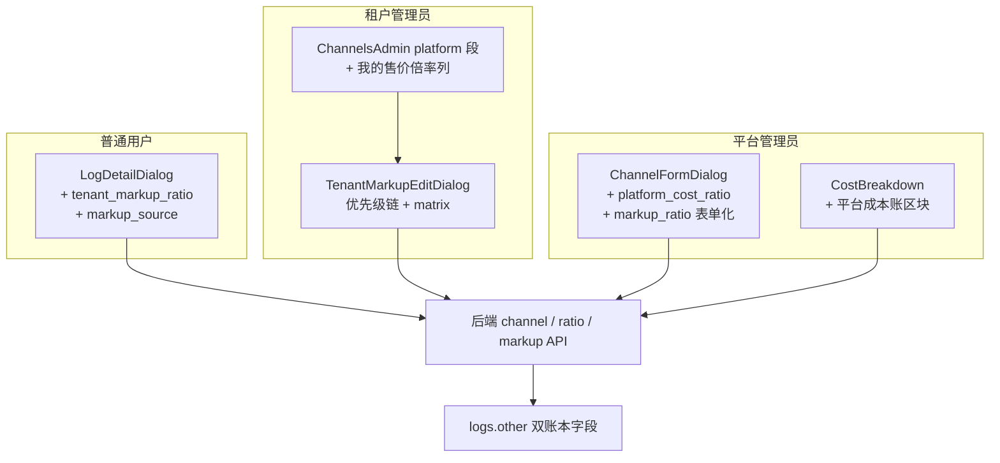

# 双账本计费管理端 UI 设计

> 日期：2026-04-24
> 状态：设计稿
> 关联后端 spec：`docs/superpowers/specs/2026-04-24-dual-ledger-billing-design.md`
> 关联后端实现：commit `e462b2a` (feat(billing): dual-ledger pricing)
> 适用范围：web-next 管理端（平台管理员 + 租户 admin + end user）

## 1. 背景

后端双账本已经上线（commit `e462b2a`）：

- `PriceData` 扩 `PlatformCost*` 字段
- `channels.platform_cost_ratio` 列
- `tenant_platform_channel_markups` 表（租户 × 平台渠道的售价覆盖）
- `logs.other` 双写 `platform_cost_quota` / `user_bill_quota` / `tenant_markup_ratio` / `platform_cost_channel_ratio`
- `EffectiveMarkup` 优先级链：`tenant_platform_channel_markups > ch.MarkupRatio > plan.PlatformMarkup > 1.0`

但是三个 UI 面还没做：

1. 平台管理员配置渠道时设不上 `platform_cost_ratio`
2. 租户没法自助配置"按平台渠道差别定价"
3. 日志查看器不展示新增的双账本字段

本 spec 覆盖这三个 UI 面的设计 + 一个必需的后端 list endpoint。

## 2. 目标

1. 平台管理员能在渠道编辑对话框里设 `platform_cost_ratio`，同时补齐 `markup_ratio` 表单化
2. 租户 admin 能在 `ChannelsAdmin.tsx`（tenantView 模式）里看到所有可用平台渠道的"我的售价倍率"列，点编辑弹出含优先级链与 matrix 预览的对话框
3. 日志查看器按角色分权展示双账本字段：end user 只见面向自己的、admin 见完整对账信息
4. 一个 PR / 一个 plan 合一批（不分阶段）

## 3. 非目标

- 不做 override 的批量编辑
- 不做 override 历史审计（另开专项）
- 不做按模型粒度的 markup（只到渠道粒度）
- 不做独立的价格模拟器页面（编辑对话框内预览足够）
- 不改动 backend 双账本计费逻辑本身（已实现）

## 4. 术语

| 名称 | 含义 |
| --- | --- |
| Platform channel | `channels.scope = 'platform'`，平台管理员建、所有租户共享 |
| Tenant channel | `channels.scope = 'tenant'`，租户自己建的私有渠道 |
| `platform_cost_ratio` | 平台成本倍率（仅平台 admin 可改），只影响平台成本账 |
| `channel.markup_ratio` | 平台给某渠道推荐的默认售价倍率（平台 admin 设，租户可覆盖） |
| `plan.platform_markup` | 租户套餐层面的全局售价倍率（租户自己设，对所有平台渠道生效） |
| `tenant_platform_channel_markups` | 租户对特定平台渠道的售价覆盖（本 spec 的核心 UI 对象） |
| Tenant user group | 租户自己划分的用户分组（`default` / `vip` 等），每个 group 有 `GroupRatio` |

## 5. 架构总览



三个 UI 面共用一套 hook 层和同一套新增 i18n namespace。

## 6. 后端补丁：list endpoint

现有：POST upsert + DELETE。新加：

**`GET /api/tenant/platform_channel_markup`**

返回当前租户所有 override 行。

```go
// controller/tenant/platform_channel_markup.go
func ListPlatformChannelMarkups(c *gin.Context) {
    tenantID := middleware.GetTenantId(c)
    if tenantID <= 0 {
        c.JSON(http.StatusForbidden, gin.H{"message": "tenant context missing"})
        return
    }
    rows, err := model.ListTenantPlatformChannelMarkups(tenantID)
    if err != nil {
        c.JSON(http.StatusInternalServerError, gin.H{"message": err.Error()})
        return
    }
    c.JSON(http.StatusOK, gin.H{"data": rows})
}
```

Model 层：

```go
// model/tenant_platform_channel_markup.go
func ListTenantPlatformChannelMarkups(tenantID int) ([]TenantPlatformChannelMarkup, error) {
    var rows []TenantPlatformChannelMarkup
    err := DB.Where("tenant_id = ?", tenantID).Find(&rows).Error
    return rows, err
}
```

路由：

```go
// router/api-router.go (tenantRoute 块内)
tenantRoute.GET("/platform_channel_markup", tenant.ListPlatformChannelMarkups)
```

不需要分页（单租户 override 数量 = 可用平台渠道数，量级小）。

## 7. Surface A：平台管理员渠道编辑

### 7.1 文件与字段

**文件**：`web-next/src/components/channels/ChannelFormDialog.tsx`

在现有"基础配置"区块增加两个字段（都放 `markup_ratio` + `platform_cost_ratio` 一组紧挨着）：

| 字段 | 类型 | 可见条件 | 语义 |
| --- | --- | --- | --- |
| `markup_ratio` | nullable number | `scope=platform` + platform admin | 该平台渠道的默认售价倍率，租户可覆盖 |
| `platform_cost_ratio` | nullable number | `scope=platform` + platform admin | 平台成本倍率，只影响平台成本账 |

现状：`markup_ratio` 已存在于 `Channel` 类型（L43）但没在 form 里渲染（半迁移状态，本次顺手补齐）。

### 7.2 表单实现

**Zod schema**（新增两项）：

```typescript
markup_ratio: z.union([z.string(), z.number()]).optional().transform((v) => {
  if (v === '' || v === null || v === undefined) return null;
  const n = typeof v === 'number' ? v : parseFloat(v);
  return Number.isFinite(n) && n > 0 ? n : null;
}),
platform_cost_ratio: z.union([z.string(), z.number()]).optional().transform((v) => {
  if (v === '' || v === null || v === undefined) return null;
  const n = typeof v === 'number' ? v : parseFloat(v);
  return Number.isFinite(n) && n > 0 ? n : null;
}),
```

**UI 渲染**：两个 Input（`type="number" step="0.01" min="0"`），标签 + placeholder + 小字说明。只在 `form.watch('scope') === 'platform'` 时渲染（non-platform 渠道这两个字段语义都不生效）。

**序列化**：Zod transform 保证发给后端的是 `number | null`。后端 Channel 定义里 `MarkupRatio *float64` 和 `PlatformCostRatio *float64` 都接受 null → NULL 存 DB。

### 7.3 API

复用现有 `useUpdateChannel()` / `useCreateChannel()`。payload 增加两个字段；后端 GORM AutoMigrate 列已就位，无需额外 backend 改动。

### 7.4 测试

`ChannelFormDialog.test.tsx` 扩展：

- 初始化时字段反序列化正确（null / 数字）
- 非 platform scope 下字段不渲染
- 清空 Input 后 submit payload 发送 `null`
- 非法值（负数 / NaN）submit 被 Zod 转成 `null`

## 8. Surface B：租户按渠道 markup

### 8.1 前端 hook 扩展

**文件**：`web-next/src/hooks/useTenantBilling.ts`（已存在，扩展）

```typescript
export function useTenantPlatformChannelMarkups() {
  return useQuery({
    queryKey: ['tenant', 'platform-channel-markups'],
    queryFn: async () => {
      const { data } = await api.get<{ data: TenantPlatformChannelMarkup[] }>(
        '/api/tenant/platform_channel_markup',
      );
      return data.data;
    },
  });
}

export function useUpsertTenantPlatformChannelMarkup() {
  const qc = useQueryClient();
  return useMutation({
    mutationFn: async (input: UpsertMarkupInput) => {
      const { data } = await api.post('/api/tenant/platform_channel_markup', input);
      return data.data;
    },
    onSuccess: () => {
      qc.invalidateQueries({ queryKey: ['tenant', 'platform-channel-markups'] });
    },
  });
}

export function useDeleteTenantPlatformChannelMarkup() {
  const qc = useQueryClient();
  return useMutation({
    mutationFn: async (channelId: number) => {
      await api.delete(`/api/tenant/platform_channel_markup/${channelId}`);
    },
    onSuccess: () => {
      qc.invalidateQueries({ queryKey: ['tenant', 'platform-channel-markups'] });
    },
  });
}

type UpsertMarkupInput = {
  channel_id: number;
  markup_ratio: number;
  enabled?: boolean;
};

type TenantPlatformChannelMarkup = {
  tenant_id: number;
  channel_id: number;
  markup_ratio: number;
  enabled: boolean;
  created_at: number;
  updated_at: number;
};
```

### 8.2 `ChannelsAdmin.tsx` 平台段表格改造

**文件**：`web-next/src/pages/ChannelsAdmin.tsx`

现有 `platformChannels.map(...)` 渲染（约 L166）加一列 "我的售价倍率"，用新组件：

```tsx
<td>
  <TenantMarkupCell
    channel={channel}
    override={overridesMap.get(channel.id)}
    planMarkup={tenantPlan.platform_markup}
    onEdit={() => setEditTarget(channel)}
  />
</td>
```

`overridesMap` 由 `useTenantPlatformChannelMarkups()` 返回值构造（Map<channel_id, row>）。`tenantPlan` 由已有 `useTenantPlan()` 提供。

### 8.3 新组件 `TenantMarkupCell`

**文件**：`web-next/src/components/channels/TenantMarkupCell.tsx`

**职责**：行内渲染倍率 + 来源 badge + 详细公式 pills。

**核心逻辑**：`resolveEffective(channel, override, planMarkup)` 按优先级链返回 `{value, source}`：

```typescript
function resolveEffective(
  channel: Channel,
  override: TenantPlatformChannelMarkup | undefined,
  planMarkup: number,
): { value: number; source: 'tenant_channel' | 'channel' | 'plan' | 'none' } {
  if (override && override.enabled && override.markup_ratio > 0) {
    return { value: override.markup_ratio, source: 'tenant_channel' };
  }
  if (channel.markup_ratio && channel.markup_ratio > 0) {
    return { value: channel.markup_ratio, source: 'channel' };
  }
  if (planMarkup > 0) {
    return { value: planMarkup, source: 'plan' };
  }
  return { value: 1.0, source: 'none' };
}
```

镜像 `service/markup.go::EffectiveMarkup` 的优先级，保持前后端一致。

**渲染**：

```
{value}x  [badge(source)]   {FormulaPills channel={ch} myMarkup={value}}   [编辑按钮]
```

- Badge 文案：`tenant_channel → 自定义` / `channel → 平台默认` / `plan → 套餐默认` / `none → 无倍率`
- Badge 颜色：`tenant_channel` 用 emerald（突出"我能改的"），其他用 muted

### 8.4 公式 Pill 链组件 `FormulaPills`

**文件**：`web-next/src/components/channels/FormulaPills.tsx`

**渲染**：

```
[tokens] × [模型倍率] × [用户分组倍率] × [我的倍率 ${value}x] × [channel_ratio ${cr}]
                           ↑ hover                ↑ 加粗高亮        ↑ 仅 ≠1 时渲染
```

**每个 pill 的实现**：`<Tooltip>` 包裹的 `<span className="rounded bg-...">`。Tooltip 内容：

| Pill | Tooltip |
| --- | --- |
| `tokens` / `调用次数` | "实际用量，按用户行为累计" |
| `模型倍率` / `模型价格` | "按模型不同，由平台全局配置；不同模型倍率不同，点击模型列表查看" |
| `用户分组倍率` | "按用户所在分组：<br/>default: 1.0<br/>vip: 0.5<br/>..." — 从 `useTenantGroupRatio()` 读 |
| `我的倍率` | "来源：{source}。{优先级链说明}" |
| `channel_ratio` | "ChannelSetting.channel_ratio = {cr}，由平台配置" |

**加粗高亮**：仅"我的倍率" pill 用 `font-semibold + ring-1 ring-emerald-500/40`，其他灰色。

**省略规则**：

- `channel_ratio` 只在 `ChannelSetting.channel_ratio ≠ 1.0` 时渲染
- 纯按次计费（`usePrice=true`）第一个 pill 显示 `调用次数`，第二个显示 `模型价格`

### 8.5 编辑对话框 `TenantMarkupEditDialog`

**文件**：`web-next/src/components/channels/TenantMarkupEditDialog.tsx`

**结构**（自上而下）：

1. **标题**：`设置 "${channelName}" 的售价倍率`
2. **优先级链**（只读展示三行，当前生效项加圆点）：
   ```
   ● 自定义覆盖    {override.markup_ratio}x   [清除覆盖]
   ○ 平台推荐默认  {channel.markup_ratio}x
   ○ 套餐默认      {plan.platform_markup}x
   ```
   没有 `override` 时第一行灰色"未设置"，"清除覆盖"按钮禁用。
3. **倍率输入**：`<Input type="number" step="0.01" min="0" />` 绑定 form state
4. **公式预览**（随输入实时更新）：
   ```
   tokens × 模型倍率 × 用户分组倍率 × [${input}]
                                        ↑ 你改的
   ```
5. **金额预览 matrix**：默认 1 列（default 分组），每 1M tokens 下各模型价格
6. **"展开其他分组"复选框**：勾选后弹 Popover 选要展示的 group（多选），追加为 matrix 的列
7. **底部操作**：`[清除覆盖 → 回退默认]  [取消]  [保存]`

**模型列表数据源**：`channel.models`（逗号分隔字符串）解析 + `useModelRatios()` hook 拿到每个模型的 `model_ratio` / `model_price`。

> `useModelRatios()` 已存在还是需要新增？如已有则直接用；如无，新增一个 hook 调后端 `GET /api/ratio_setting/model_ratio`（该路由已存在于 platform admin）。若该路由仅限 platform admin，则在 `/api/tenant/model_ratios`（新加）做一份不含敏感字段的只读镜像。**本 spec 假设复用现有路由，plan 落地时验证**。

**分组数据源**：`useTenantGroupRatio()` hook（已存在，从 `tenant_options.GroupRatio` 读）返回 `Record<string, number>`。

**金额计算**（纯前端）：

```typescript
function previewQuotaPerMillion(
  modelRatio: number,
  groupRatio: number,
  markup: number,
  channelRatio: number,
): number {
  return 1_000_000 * modelRatio * groupRatio * markup * (channelRatio || 1);
}

function quotaToCurrency(quota: number, currency: 'USD' | 'CNY'): string {
  const usd = quota / QUOTA_PER_USD; // QUOTA_PER_USD 已是前端常量
  if (currency === 'CNY') {
    return `¥${(usd * USD_CNY_RATE).toFixed(2)}`;
  }
  return `$${usd.toFixed(2)}`;
}
```

币种按 `tenantPlan.currency`（或全局设置）。

**保存行为**：

- 输入值等于 `plan.platform_markup` → 弹 confirm "值等同于套餐默认，保留覆盖意味着锁定此渠道；建议清除覆盖让它随套餐默认变化。保留 / 清除 / 取消"
- 输入值 ≤ 0 → submit 按钮禁用
- 点"清除覆盖"→ 调 `useDeleteTenantPlatformChannelMarkup()` + 关对话框
- 点"保存"→ 调 `useUpsertTenantPlatformChannelMarkup()` + toast 成功提示 + 关对话框

**加载态**：对话框刚开时可能 `useTenantGroupRatio()` 还没返回，展示 skeleton；确认数据就位再渲染 matrix。

### 8.6 测试

- `TenantMarkupCell.test.tsx`：
  - 四种来源下渲染正确 badge
  - `channel_ratio = 1.0` 时 pill 链里不渲染 channel_ratio
  - hover "用户分组倍率" pill 显示完整分组映射
- `TenantMarkupEditDialog.test.tsx`：
  - 输入数字 → 公式 pill 里的数字同步更新
  - 输入数字 → matrix 默认 default 分组的金额同步更新
  - 勾选"展开其他分组"→ 选 `vip` → matrix 追加 vip 列
  - 点"清除覆盖"→ 调 delete mutation
  - 输入值等于 `plan.platform_markup` → 保存时弹 confirm

## 9. Surface C：日志双账本字段

### 9.1 类型扩展

**文件**：`web-next/src/components/logs/CostBreakdown.tsx`（已有 `OtherData` 和 `parseOther`）

```typescript
type OtherData = {
  // ...existing fields
  pricing_version?: string;
  user_bill_quota?: number;
  platform_cost_quota?: number;
  tenant_markup_ratio?: number;
  platform_cost_channel_ratio?: number;
  platform_channel?: boolean;
};
```

### 9.2 End user 视图：`LogDetailDialog.tsx`

**文件**：`web-next/src/components/logs/LogDetailDialog.tsx`

现状：`log.other` 渲染为原始 JSON 字符串（L41 `<Row label={t('detail.other')} value={log.other} />`）。

改造：`parseOther(log.other)` 后按字段渲染，**只展示**：

```
<Row label={t('detail.tenant_markup_ratio')} value={other.tenant_markup_ratio} />
<Row label={t('detail.markup_source')} value={markupSourceLabel(other)} />
```

`markupSourceLabel(other)` 基于现有 `markup_source` 字段（后端已有）渲染本地化标签。

**不展示**：`platform_cost_quota` / `platform_cost_channel_ratio` / `pricing_version` / `platform_channel`。

保留原有 `log.other` 原始 JSON 可被 admin 在 `CostBreakdown` 里看到（现有行为），普通用户不展示 JSON 原文（避免字段泄漏）。

> 如果现有 `LogDetailDialog` 也对 admin 渲染（不分权），改造时加 `isAdmin` prop 分叉渲染。本 spec 假设 `LogDetailDialog` 是 end user 用的、admin 有独立 `CostBreakdown` 入口，plan 落地时验证。

### 9.3 Admin 视图：`CostBreakdown.tsx`

**文件**：`web-next/src/components/logs/CostBreakdown.tsx`

现有区块展示用户账单的明细（model_ratio / cache_tokens / etc）。**新增一个平台成本账区块**：

```tsx
{other.pricing_version === 'dual-ledger-v1' && (
  <section className="border-t pt-3 mt-3">
    <h4>{t('cost_breakdown.platform_cost.title')}</h4>
    <Row label={t('cost_breakdown.platform_cost.quota')} value={other.platform_cost_quota} />
    <Row
      label={t('cost_breakdown.platform_cost.channel_ratio')}
      value={other.platform_cost_channel_ratio}
    />
    <Row
      label={t('cost_breakdown.platform_cost.is_platform_channel')}
      value={other.platform_channel ? t('common.yes') : t('common.no')}
    />
    <Row
      label={t('cost_breakdown.delta')}
      value={`${other.user_bill_quota} → ${other.platform_cost_quota}`}
    />
  </section>
)}
```

`pricing_version === 'dual-ledger-v1'` guard 保证旧日志行（无新字段）不渲染新区块。

### 9.4 测试

- `LogDetailDialog.test.tsx`：
  - `other.platform_cost_quota` 存在时不渲染此字段
  - `other.tenant_markup_ratio` 存在时渲染
- `CostBreakdown.test.tsx`：
  - `pricing_version === 'dual-ledger-v1'` → 平台成本账区块渲染
  - 缺 `pricing_version` → 不渲染
  - `platform_channel = true` → "租户渠道类型"显示"平台共享"

## 10. 跨 Surface 关注点

### 10.1 i18n

新 keys 按 namespace 组织：

**`web-next/src/i18n/locales/{en,zh}/channels.json`**:

```json
{
  "dialog": {
    "markup_ratio": {
      "label": "对租户售价倍率 / Default Markup Ratio",
      "placeholder": "留空视为 1.0 / Leave blank for 1.0",
      "help": "平台为此渠道给所有租户推荐的售价倍率；租户可覆盖。/ Recommended default markup — tenants can override."
    },
    "platform_cost_ratio": {
      "label": "平台成本倍率 / Platform Cost Ratio",
      "placeholder": "留空视为 1.0 / Leave blank for 1.0",
      "help": "只影响平台成本账，不影响租户对用户的售价 / Affects only the platform cost ledger."
    }
  },
  "tenant_markup_cell": {
    "source": {
      "tenant_channel": "自定义 / Custom",
      "channel": "平台默认 / Platform Default",
      "plan": "套餐默认 / Plan Default",
      "none": "无 / None"
    },
    "formula": {
      "tokens": "tokens",
      "call_count": "调用次数 / Calls",
      "model_ratio": "模型倍率 / Model Ratio",
      "model_price": "模型价格 / Model Price",
      "group_ratio": "用户分组倍率 / User Group Ratio",
      "my_markup": "我的倍率 / My Markup",
      "channel_ratio": "渠道倍率 / Channel Ratio"
    },
    "edit": "编辑 / Edit"
  },
  "tenant_markup_dialog": {
    "title": "设置 \"{{channelName}}\" 的售价倍率 / Set markup for \"{{channelName}}\"",
    "priority_chain": {
      "tenant_channel": "自定义覆盖 / Custom override",
      "channel": "平台推荐默认 / Platform default",
      "plan": "套餐默认 / Plan default",
      "not_set": "未设置 / Not set"
    },
    "preview": {
      "title": "金额预览 / Preview",
      "per_million_tokens": "每 1M tokens / per 1M tokens",
      "compare_with_default": "({{default}}x 时 {{value}})",
      "expand_groups": "展开其他分组 / Expand other groups"
    },
    "clear_override": "清除覆盖 → 回退默认 / Clear override",
    "save": "保存 / Save",
    "cancel": "取消 / Cancel",
    "confirm_equal_to_plan": "此值等同于套餐默认 ({{plan}}x)。保留覆盖会锁定此渠道不随套餐变化。/ Equals plan default; keeping override locks this channel."
  }
}
```

**`web-next/src/i18n/locales/{en,zh}/logs.json`**:

```json
{
  "detail": {
    "tenant_markup_ratio": "租户倍率 / Tenant Markup Ratio",
    "markup_source": "倍率来源 / Markup Source"
  },
  "cost_breakdown": {
    "platform_cost": {
      "title": "平台成本账（管理员视图）/ Platform Cost Ledger (Admin)",
      "quota": "平台成本 quota / Platform Cost Quota",
      "channel_ratio": "平台成本渠道倍率 / Platform Cost Channel Ratio",
      "is_platform_channel": "平台共享渠道 / Is Platform Channel"
    },
    "delta": "用户账单 → 平台成本 / User Bill → Platform Cost"
  }
}
```

双语同步加，现有模式。

### 10.2 错误处理

| 场景 | 处理 |
| --- | --- |
| 保存倍率失败（400 / 403 / 500） | sonner toast 红色，错误内容来自 response.message |
| list endpoint 失败（5xx） | 降级为"全部显示为套餐默认"，表格照常渲染，顶部 banner 提示"加载覆盖失败，显示套餐默认" |
| 分组倍率 hook 失败 | 公式 pill 的 group_ratio tooltip 显示"加载失败"，不阻断主流程 |
| 模型倍率 hook 失败 | matrix 预览空置，显示"金额预览加载失败"；倍率仍可保存 |
| 输入非法（负数 / NaN / 空） | 保存按钮禁用，Input 红色边框 + 小字错误 |
| 权限不足（403） | 跳转登录或 toast 提示；具体依现有权限中间件逻辑 |

### 10.3 性能

- `useTenantPlatformChannelMarkups` staleTime 30s，避免打开渠道页频繁拉取
- `useModelRatios` staleTime 5min（模型倍率变化低频）
- `ChannelsAdmin.tsx` 的 platform 段如果渠道数 > 50，性能敏感；当前实现用 `.map` 直接渲染，先不做虚拟滚动 —— 渠道数达到阈值再加
- Matrix 预览在输入倍率时防抖 200ms，避免 onChange 每字符重算

### 10.4 无障碍

- 所有 pill 的 hover tooltip 同时支持 keyboard focus
- 对话框符合 shadcn Dialog 的 a11y 默认（aria-labelledby / Esc 关闭 / focus trap）
- 倍率来源 badge 的颜色不作为唯一语义信号，文案同步

## 11. 文件结构

### 新增

| 文件 | 作用 |
| --- | --- |
| `web-next/src/components/channels/TenantMarkupCell.tsx` | 行内倍率单元格（倍率 + badge + 公式 pills） |
| `web-next/src/components/channels/TenantMarkupEditDialog.tsx` | 编辑对话框（优先级链 + matrix 预览） |
| `web-next/src/components/channels/FormulaPills.tsx` | 公式 pill 链组件（可复用） |
| `web-next/src/components/channels/TenantMarkupCell.test.tsx` | 单元测试 |
| `web-next/src/components/channels/TenantMarkupEditDialog.test.tsx` | 单元测试 |

### 修改

| 文件 | 改动 |
| --- | --- |
| `controller/tenant/platform_channel_markup.go` | 加 `ListPlatformChannelMarkups` |
| `model/tenant_platform_channel_markup.go` | 加 `ListTenantPlatformChannelMarkups` |
| `router/api-router.go` | 注册 GET 路由 |
| `web-next/src/hooks/useTenantBilling.ts` | 加三个 hook（list / upsert / delete） |
| `web-next/src/hooks/useChannels.ts` | 类型加 `platform_cost_ratio?: number \| null` |
| `web-next/src/components/channels/ChannelFormDialog.tsx` | 加 markup_ratio + platform_cost_ratio 字段 |
| `web-next/src/pages/ChannelsAdmin.tsx` | platform 段加 "我的售价倍率" 列 |
| `web-next/src/components/logs/LogDetailDialog.tsx` | 加 tenant_markup_ratio + markup_source 渲染 |
| `web-next/src/components/logs/CostBreakdown.tsx` | 扩 OtherData + 加平台成本账区块 |
| `web-next/src/i18n/locales/en/channels.json` | 新 keys |
| `web-next/src/i18n/locales/zh/channels.json` | 新 keys |
| `web-next/src/i18n/locales/en/logs.json` | 新 keys |
| `web-next/src/i18n/locales/zh/logs.json` | 新 keys |

## 12. 落地顺序建议

尽管 Plan 打一个包，执行上建议按依赖顺序：

1. 后端 list endpoint（Surface B 前置依赖）
2. Hook 层（`useTenantBilling.ts` 三个 hook + `useChannels` 类型扩展）
3. Surface C 的类型扩展 + LogDetailDialog + CostBreakdown
4. Surface A 的 ChannelFormDialog
5. Surface B 的 FormulaPills → TenantMarkupCell → TenantMarkupEditDialog
6. `ChannelsAdmin.tsx` 集成（依赖 5 的组件）
7. i18n 同步双语
8. 测试

## 13. 决策记录

| 决策 | 结论 |
| --- | --- |
| 三个 UI 面如何排？ | 一个 plan / 一个 PR 打包 |
| 租户按渠道 markup 放哪？ | 复用现有 ChannelsAdmin 的 platform 段 |
| 行内展示什么？ | 倍率 + 来源 badge + 详细公式 pill 链（带 hover） |
| 编辑对话框展示什么？ | 优先级链 + 公式 + matrix 金额预览（默认 default 分组，勾选展开其他分组） |
| 日志字段分权？ | end user 见 `tenant_markup_ratio` + `markup_source`；admin CostBreakdown 见全部四个字段 |
| Surface A 是否顺手补齐 markup_ratio 表单？ | 是，和 platform_cost_ratio 紧挨着放 |
| 编辑对话框 matrix 货币？ | 按租户套餐币种（USD / CNY）格式化 |

## 14. 非目标（重申）

- 不做 override 批量编辑
- 不做 override 变更历史审计
- 不做按模型粒度 markup
- 不做独立价格模拟器页面
- 不改动后端双账本计费逻辑（已实现）

## 15. 风险

1. **`useModelRatios` / `useTenantGroupRatio` 是否存在**：Plan 落地第一步要验证；若不存在则新增。不应阻塞本 spec 整体推进。
2. **matrix 预览金额和后端实际扣费是否精确匹配**：前端纯用 `number` 不用 `decimal.Decimal`，floating-point 可能和后端 `shopspring/decimal` 产生末位差。预览只到整元/整分精度，差异可接受。
3. **渠道数量极多时性能**：单页渲染 100+ 行 × 每行 5+ pill + tooltip，可能慢。超过阈值再虚拟化；本 spec 先不做。
4. **租户端 `LogDetailDialog` 当前是否已分权**：spec §9.2 假设 LogDetailDialog 只给 end user 用、admin 有独立入口。plan 落地时验证；若现状不一致，加 `isAdmin` prop 分叉。
