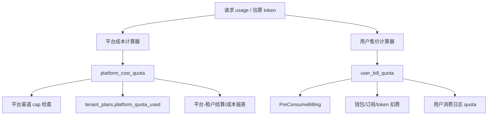

# 双账本计费设计：平台成本账与用户售价账解耦

> 日期：2026-04-24
> 状态：设计稿
> 适用范围：平台共享渠道、租户自定义售价、租户平台渠道额度上限

## 1. 背景

当前平台渠道计费大致是：

```text
用户扣费 quota -> StripMarkup(platform_markup) -> 平台渠道额度 used
```

这属于“从用户售价反推平台成本”。在只存在 `platform_markup` 一个租户售价层时可以工作，但一旦租户可控价格项变多，就容易污染平台成本账。

已经确认的风险点：

- `GroupRatio` 当前允许租户覆盖。
- `GroupRatio` 会进入用户扣费。
- 平台渠道额度只剥离 `platform_markup`，不会剥离 `GroupRatio`。
- 如果租户把 `GroupRatio` 调低，用户扣费和平台渠道额度都会降低，平台真实成本可能被低估。

因此平台成本账不能继续从用户账单倒推，必须独立计算。

## 2. 目标

1. 平台成本账只读取平台控制的成本配置，租户不能通过任何可编辑配置降低平台成本计量。
2. 用户售价账可以读取租户配置，用于租户面向自己用户的售价策略。
3. 同一请求同时产生两个额度：
   - `platform_cost_quota`：平台对租户的成本计量。
   - `user_bill_quota`：最终从用户钱包、订阅、令牌额度扣除的额度。
4. 平台渠道 cap、平台结算、平台渠道成本统计只使用 `platform_cost_quota`。
5. 用户消费日志、钱包扣费、订阅扣费、token 扣费继续使用 `user_bill_quota`。
6. 现有系统尚未上线，允许做清晰的字段和语义调整，不需要兼容旧数据。

## 3. 非目标

- 不在本轮实现真实供应商账单导入。
- 不做动态成本，比如按时间、负载、库存变化自动调价。
- 不重构所有模型价格配置后台 UI。
- 不改变用户钱包、订阅、token 三套资金来源的基本扣费生命周期。
- 不把租户自定义价格能力做成任意公式引擎。

## 4. 术语

| 名称 | 含义 | 控制方 | 用途 |
| --- | --- | --- | --- |
| 平台成本账 | 平台认为租户本次使用平台渠道消耗了多少成本额度 | 平台 | cap、平台结算、平台成本分析 |
| 用户售价账 | 租户向自己用户收取多少额度 | 租户/平台 | 钱包、订阅、token、消费日志 |
| 成本倍率 | 平台定义的模型或渠道成本换算倍率 | 平台 | 只影响平台成本账 |
| 售价倍率 | 租户定义的加价或让利倍率 | 租户 | 只影响用户售价账 |
| `GroupRatio` | 用户侧分组价格策略 | 租户可选 | 只允许影响用户售价账 |
| `platform_markup` | 租户使用平台渠道时的全局售价倍率 | 租户 | 只允许影响用户售价账 |

## 5. 目标架构



核心规则：

```text
platform_cost_quota 不从 user_bill_quota 反推
user_bill_quota 不作为平台成本依据
```

## 6. 计费公式

### 6.1 平台成本账

平台成本账只使用平台控制配置。

按 token 倍率：

```text
platform_cost_quota =
  usage_tokens_with_platform_semantics
  × platform_model_cost_ratio
  × platform_channel_cost_ratio
  × platform_cost_other_ratios
```

按固定价格：

```text
platform_cost_quota =
  platform_model_cost_price
  × QuotaPerUnit
  × platform_channel_cost_ratio
  × platform_cost_other_ratios
```

说明：

- `platform_model_cost_ratio / platform_model_cost_price` 由平台配置。
- `platform_channel_cost_ratio` 由平台配置，表达平台给租户使用某个共享渠道的真实成本口径。
- `platform_cost_other_ratios` 只允许放平台认可的客观成本因子，如图片数量、视频秒数、分辨率、web search 次数。
- 不读取租户 `GroupRatio`、`GroupGroupRatio`、`platform_markup`、未来的租户渠道售价倍率。

### 6.2 用户售价账

用户售价账可以读取租户价格配置。

按 token 倍率：

```text
user_bill_quota =
  usage_tokens_with_user_billing_semantics
  × tenant_model_ratio_or_platform_default
  × tenant_group_ratio
  × tenant_channel_price_ratio
  × tenant_platform_channel_markup
  × user_bill_other_ratios
```

按固定价格：

```text
user_bill_quota =
  tenant_model_price_or_platform_default
  × QuotaPerUnit
  × tenant_group_ratio
  × tenant_channel_price_ratio
  × tenant_platform_channel_markup
  × user_bill_other_ratios
```

说明：

- `GroupRatio` 只影响 `user_bill_quota`。
- `platform_markup` 只影响 `user_bill_quota`。
- 未来的 `tenant_platform_channel_markups` 只影响 `user_bill_quota`。
- 用户账单可以低于平台成本，但这属于租户让利策略，平台成本账不会因此降低。

## 7. 配置边界

### 7.1 平台控制配置

这些配置只允许平台管理员修改：

- 平台模型成本倍率。
- 平台模型成本固定价格。
- 平台渠道成本倍率。
- 平台渠道启用状态和模型能力。
- 租户平台渠道额度 cap。

建议新配置命名：

```text
PlatformModelCostRatio
PlatformModelCostPrice
ChannelPlatformCostRatio
```

也可以先复用现有平台全局 `ModelRatio / ModelPrice` 作为平台成本源，但要在代码中明确它们属于平台成本读路径。

### 7.2 租户控制配置

这些配置只能影响用户售价账：

- `GroupRatio`
- `GroupGroupRatio`
- `TopupGroupRatio`
- `platform_markup`
- 未来的租户-平台渠道售价倍率

### 7.3 必须禁止的隐式耦合

禁止在平台成本计算中读取：

```text
service.GetTenantGroupRatioMap
service.GetTenantGroupGroupRatioMap
tenant_options.GroupRatio
tenant_options.GroupGroupRatio
TenantPlan.PlatformMarkup
tenant_platform_channel_markups
```

禁止在平台渠道 cap 中使用：

```text
StripMarkup(user_bill_quota, markup)
```

`StripMarkup` 可以保留为兼容或临时对比工具，但不应作为新平台成本账的依据。

## 8. 数据模型

### 8.1 `types.PriceData`

现有字段继续代表用户售价账：

```go
type PriceData struct {
    Quota             int
    QuotaToPreConsume int
    // ...
}
```

新增平台成本账字段：

```go
type PriceData struct {
    // 用户售价账
    Quota             int
    QuotaToPreConsume int

    // 平台成本账
    PlatformCostQuota             int
    PlatformCostQuotaToPreConsume int

    PlatformCostModelRatio   float64
    PlatformCostModelPrice   float64
    PlatformCostChannelRatio float64
    PlatformCostOtherRatios  map[string]float64

    UserMarkupRatio  float64
    UserPricingSource string
}
```

命名原则：

- `Quota` 不改名，减少现有扣费路径改动。
- 所有平台成本字段必须带 `PlatformCost` 前缀。
- 所有租户售价字段必须带 `User`、`Tenant` 或明确售价语义，避免误用。

### 8.2 平台渠道成本倍率

在 `channels` 增加平台成本倍率：

```go
PlatformCostRatio *float64 `json:"platform_cost_ratio" gorm:"type:decimal(10,4);default:null"`
```

语义：

- 仅 `scope = platform` 时生效。
- `nil` 表示 `1.0`。
- 只能平台管理员编辑。
- 只影响 `platform_cost_quota`。

### 8.3 租户-平台渠道售价倍率

新增表：

```go
type TenantPlatformChannelMarkup struct {
    TenantId    int     `json:"tenant_id" gorm:"primaryKey;not null"`
    ChannelId   int     `json:"channel_id" gorm:"primaryKey;not null;index"`
    MarkupRatio float64 `json:"markup_ratio" gorm:"type:decimal(10,4);not null"`
    Enabled     bool    `json:"enabled" gorm:"not null;default:true"`
    CreatedAt   int64   `json:"created_at" gorm:"bigint;autoCreateTime"`
    UpdatedAt   int64   `json:"updated_at" gorm:"bigint;autoUpdateTime"`
}
```

售价倍率优先级：

```text
租户-平台渠道售价倍率 > tenant_plan.platform_markup > 1.0
```

这个表只影响用户售价账。

### 8.4 消费日志

`logs.quota` 继续表示用户实际扣费。

`logs.other` 增加：

```json
{
  "pricing_version": "dual-ledger-v1",
  "user_bill_quota": 150,
  "platform_cost_quota": 100,
  "tenant_markup_ratio": 1.5,
  "platform_cost_channel_ratio": 1.0,
  "platform_channel": true
}
```

后续如果需要正式对账，新增明细账表：

```go
type TenantPlatformChannelUsageLedger struct {
    Id                int64  `gorm:"primaryKey"`
    TenantId          int    `gorm:"index;not null"`
    ChannelId         int    `gorm:"index;not null"`
    RequestId         string `gorm:"type:varchar(64);index"`
    UserId            int    `gorm:"index;not null"`
    TokenId           int    `gorm:"index;not null"`
    ModelName         string `gorm:"type:varchar(255);index"`
    UserBillQuota     int    `gorm:"not null"`
    PlatformCostQuota int    `gorm:"not null"`
    CreatedAt         int64  `gorm:"bigint;autoCreateTime"`
}
```

本轮可以先不落表，只在日志 `other` 中记录，等上线前压测和财务口径确认后再加。

## 9. 代码设计

### 9.1 新增平台成本计算器

建议新增文件：

```text
relay/helper/platform_cost.go
```

提供估算和实际结算两个入口：

```go
func ComputePlatformCostEstimate(
    c *gin.Context,
    info *relaycommon.RelayInfo,
    promptTokens int,
    meta *types.TokenCountMeta,
) types.PlatformCostData

func ComputePlatformCostActual(
    c *gin.Context,
    info *relaycommon.RelayInfo,
    usage *dto.Usage,
) types.PlatformCostData
```

或直接回填到 `info.PriceData`：

```go
func FillPlatformCostEstimate(c *gin.Context, info *relaycommon.RelayInfo, promptTokens int, meta *types.TokenCountMeta)
func FillPlatformCostActual(c *gin.Context, info *relaycommon.RelayInfo, usage *dto.Usage)
```

计算器规则：

- 如果当前渠道不是 `scope = platform`，平台成本字段为 0。
- 如果是平台渠道，成本计算只读取平台成本配置。
- 成本计算要复用现有 usage 语义处理，避免 Claude cache、OpenRouter cache、音频 token 等重复分叉。

### 9.2 用户售价计算器

现有 `ModelPriceHelper` 和 `calculateTextQuotaSummary` 继续负责用户售价账。

需要改名或加注释，明确：

```text
ModelPriceHelper 计算 user_bill 预扣，不是平台成本。
calculateTextQuotaSummary 计算 user_bill 实际结算，不是平台成本。
```

### 9.3 平台 cap 检查

当前：

```go
projected = StripMarkup(projected, info.PriceMarkupRatio)
CheckTenantPlatformChannelQuota(info.TenantId, projected)
```

目标：

```go
projected := info.PriceData.PlatformCostQuotaToPreConsume
if projected <= 0 {
    projected = info.PriceData.PlatformCostQuota
}
CheckTenantPlatformChannelQuota(info.TenantId, projected)
```

如果平台成本字段为 0：

- 非平台渠道：跳过。
- 平台渠道：视为配置错误，建议 fail closed，返回 `tenant_quota_exceeded` 或 `model_price_error` 类型错误。

### 9.4 平台用量累计

当前：

```go
tenantCost := StripMarkup(actualQuota, relayInfo.PriceMarkupRatio)
IncrementTenantPlatformChannelUsed(relayInfo.TenantId, tenantCost)
```

目标：

```go
tenantCost := relayInfo.PriceData.PlatformCostQuota
IncrementTenantPlatformChannelUsed(relayInfo.TenantId, tenantCost)
```

这里不再接收 `actualQuota` 反推平台成本。

### 9.5 预扣和结算生命周期

用户资金生命周期不变：

```text
PreConsumeBilling(user_bill_preconsume)
SettleBilling(user_bill_actual)
Refund(user_bill_preconsume)
```

平台成本生命周期新增：

```text
FillPlatformCostEstimate
EnforcePlatformChannelQuota(platform_cost_preconsume)
FillPlatformCostActual
TrackPlatformChannelUsage(platform_cost_actual)
```

如果请求失败：

- 用户预扣照旧退款。
- 平台成本不累计。
- 违规费若发生，属于用户账单特殊费用；是否计入平台成本需单独策略，默认不计入平台渠道成本。

## 10. 路径覆盖

### 10.1 普通文本 / Responses / Claude / Gemini / Embedding / Rerank / Image

需要覆盖：

- 预扣前填充 `PlatformCostQuotaToPreConsume`。
- handler 中 `ApplyChannelBillingOverrides` 后不再用 `StripMarkup` 检查 cap。
- 实际 usage 返回后填充 `PlatformCostQuota`。
- `SettleBilling` 后累计 `platform_quota_used`。

### 10.2 Task / Video / Suno / Kling / Jimeng

Task 当前按次或按参数倍率预扣，且 `ForcePreConsume = true`。

需要覆盖：

- `ModelPriceHelperPerCall` 计算用户售价。
- 独立计算 `PlatformCostQuota`。
- cap 用 `PlatformCostQuota`。
- `SettleBilling` 和 `LogTaskConsumption` 中记录双账字段。
- task polling 后续重算时，如果 actual quota 调整，也要同步重算平台成本账。

### 10.3 Midjourney

MJ 当前部分路径直接 `PostConsumeQuota`，不一定进入 `BillingSession`。

需要覆盖：

- 成功后用户扣费仍走 `PostConsumeQuota(priceData.Quota)`。
- 平台成本累计改为 `TrackPlatformChannelUsage(platformCostQuota)`。
- 日志 `other` 写入双账字段。

### 10.4 Realtime / WSS

Realtime 有旧路径直接 `PostConsumeQuota`。

需要覆盖：

- 按实际 realtime usage 独立计算平台成本。
- 不从 `quota` 反推平台成本。

## 11. 迁移策略

系统未上线，可以采用直接切换，但建议仍分阶段开发，方便验证。

### 阶段 A：双写对比

1. 新增平台成本字段。
2. 平台成本计算器写入 `PriceData.PlatformCost*`。
3. 日志写入：
   - `old_strip_markup_cost`
   - `platform_cost_quota`
   - `user_bill_quota`
4. 暂时不改 cap 和累计逻辑。

### 阶段 B：切换平台 cap

1. `EnforcePlatformChannelQuota` 改用平台成本字段。
2. `TrackPlatformChannelUsageIfApplicable` 改用平台成本字段。
3. 删除或降级 `StripMarkup` 在平台成本路径上的使用。

### 阶段 C：收紧租户配置边界

1. 保留租户 `GroupRatio`，但明确它只影响用户售价。
2. 如果短期做不到双账，必须临时从 `TenantOverridableKeys` 移除 `GroupRatio / GroupGroupRatio`。
3. 双账完成后，租户可以继续配置 `GroupRatio`，因为平台成本已不读它。

### 阶段 D：租户-平台渠道售价倍率

1. 新增 `tenant_platform_channel_markups`。
2. 用户售价账读取该表。
3. 平台成本账不读取该表。

## 12. 验收测试

### 12.1 GroupRatio 不影响平台成本

场景：

```text
平台成本基础值 = 100
租户 GroupRatio = 0.1
租户 platform_markup = 1
```

期望：

```text
user_bill_quota = 10
platform_cost_quota = 100
platform_quota_used += 100
```

### 12.2 platform_markup 不影响平台成本

场景：

```text
平台成本基础值 = 100
租户 GroupRatio = 1
租户 platform_markup = 2
```

期望：

```text
user_bill_quota = 200
platform_cost_quota = 100
platform_quota_used += 100
```

### 12.3 租户渠道售价倍率不影响平台成本

场景：

```text
租户 A 对平台渠道 #10 设置 markup 1.5
租户 B 对平台渠道 #10 设置 markup 0.8
平台成本基础值 = 100
```

期望：

```text
租户 A user_bill_quota = 150, platform_cost_quota = 100
租户 B user_bill_quota = 80,  platform_cost_quota = 100
```

### 12.4 平台渠道 cap 使用平台成本

场景：

```text
platform_quota_cap = 500
platform_quota_used = 450
platform_cost_quota_to_preconsume = 60
user_bill_quota_to_preconsume = 6
```

期望：

```text
请求被拒绝，因为 450 + 60 > 500
不能因为用户账单只有 6 就放行
```

### 12.5 非平台渠道不累计平台成本

场景：

```text
scope = tenant
user_bill_quota = 100
```

期望：

```text
platform_cost_quota = 0
platform_quota_used 不变
```

### 12.6 Task/MJ 参数倍率一致

视频时长、分辨率、图片数量等客观倍率：

- 应进入用户售价账。
- 应进入平台成本账。
- 但租户售价倍率只进入用户售价账。

## 13. 安全约束

1. 平台成本计算器必须 fail closed：平台渠道缺少成本配置时，不允许按 0 成本放行。
2. 租户配置读取函数不得出现在平台成本计算器中。
3. 平台成本字段不得由客户端传入。
4. 租户管理员不得修改 `PlatformCostRatio`。
5. 任何新价格配置都必须标注属于“平台成本层”还是“用户售价层”。

## 14. 实施清单

- [ ] 为 `PriceData` 增加平台成本字段。
- [ ] 新增平台成本计算器。
- [ ] 为平台渠道增加 `PlatformCostRatio`。
- [ ] 将 `EnforcePlatformChannelQuota` 改为使用平台成本字段。
- [ ] 将平台渠道用量累计改为使用平台成本字段。
- [ ] 在消费日志 `other` 中写入双账字段。
- [ ] 覆盖普通文本、音频、图片、Responses、Claude、Gemini、Embedding、Rerank。
- [ ] 覆盖 Task、Video、Suno、Kling、Jimeng。
- [ ] 覆盖 Midjourney 和 Realtime 特殊路径。
- [ ] 新增租户-平台渠道售价倍率表。
- [ ] 为租户后台展示用户售价倍率和平台成本字段。
- [ ] 增加双账本回归测试。

## 15. 推荐落地顺序

1. 先实现双账字段和平台成本计算器。
2. 先在日志中双写对比，不马上改 cap。
3. 核对普通文本和 task/MJ 的成本结果。
4. 切换平台 cap 和 `platform_quota_used`。
5. 再开放租户自定义售价能力。

这个顺序能避免一边改价格体系、一边改平台成本账，导致问题不好定位。

## 16. 决策记录

| 决策 | 结论 |
| --- | --- |
| 平台计费是否继续从用户账单反推 | 否 |
| 租户 `GroupRatio` 是否允许影响平台成本 | 否 |
| `platform_markup` 是否影响平台成本 | 否 |
| `logs.quota` 表示什么 | 用户实际扣费 |
| `tenant_plans.platform_quota_used` 表示什么 | 平台成本账累计 |
| 平台渠道 cap 用什么判断 | `platform_cost_quota_to_preconsume` |
| 用户钱包/订阅/token 扣什么 | `user_bill_quota` |

